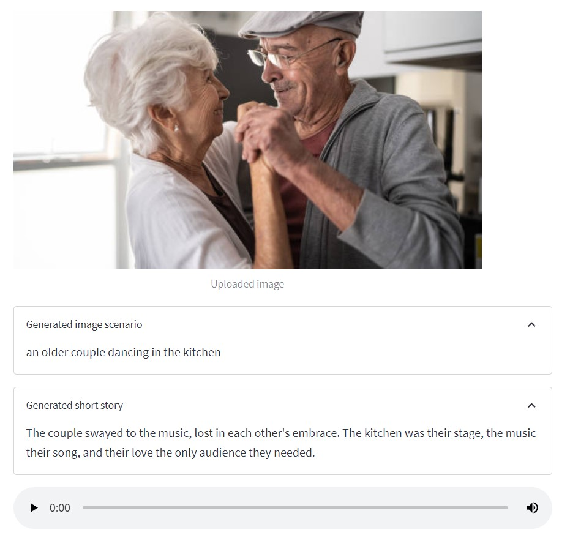

# Image-to-Speech-GenAI-tool

An AI tool that receives an image and uses generative AI to create a narrated short story in an audio file about the context of the image.

The tool utilizes Hugging Face Transformers open-source framework for deep learning in combination with OpenAI prompting via Langchain framework.

# Approach

Execution is devided into 3 parts:
- **Image to text:**
  an image-to-text transformer model ([Salesforce/blip-image-captioning-base](https://huggingface.co/Salesforce/blip-image-captioning-base)) is used to generate a text scenario based on the on the AI understanding of the image context
- **Text to story:**
  OpenAI LLM model is prompted to create a short story based on the generated scenario
- **Story to speech:**
  a text-to-speech transformer model ([espnet/kan-bayashi_ljspeech_vits](https://huggingface.co/espnet/kan-bayashi_ljspeech_vits)) is used to convert the generated short story into a voice-narrated audio file
- A user interface is built using streamlit to enable uploading the image and playing the audio file

# requirements

- os
- dotenv
- transformers
- langchain
- requests
- streamlit

# Using the app

- Before using the app, the user should have personal tokens for Hugging Face and Open AI
- The user should save the personal tokens in an ".env" file within the package as string objects under object names: HUGGINGFACE_TOKEN and OPENAI_TOKEN
- The user can then run the app using the command: streamlit run app.py
- Once the app is running on streamlit, the user can upload the target image
- Execution will start automatically and it may take a few minutes to complete
- Once completed, the app will display:
  - The scenario text generated by the image-to-text transformer model
  - The short story generated by prompting the OpenAI LLM
  - The autio file narrating the short story generated by the text-to-speech transformer model
- The audio file along with the image will be saved in "audio-img" folder inside the package
